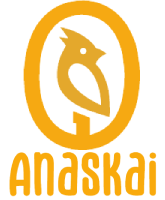

# 🧠 Pragdata — Cyber-Intelligence Knowledge Archive

   

> **Organiza, conecta y visualiza tu conocimiento tecnológico con estilo cyberpunk.**

**Pragdata** es un archivo de conocimiento interactivo que te permite almacenar recursos tecnológicos, conectarlos mediante relaciones semánticas y visualizarlos en un grafo 3D. Todo con persistencia local en JSON y una interfaz cyber-intelligence elegante y funcional.

  
  
  
  
  
  

---

## 📋 Tabla de Contenidos

- [Características](#-características)
- [Instalación Local](#-instalación-local)
- [Despliegue en PythonAnywhere](#-despliegue-en-pythonanywhere)
- [Guía de Uso](#-guía-de-uso)
- [Estructura del Proyecto](#-estructura-del-proyecto)
- [Atajos de Teclado](#-atajos-de-teclado)
- [Versión Móvil](#-versión-móvil)
- [Contribuir](#-contribuir)
- [Licencia](#-licencia)

---

## ✨ Características

| Funcionalidad | Descripción |
|---|---|
| 📇 85 recursos iniciales | Base de datos curada con herramientas de IA, desarrollo, finanzas, privacidad y más |
| 🏷️ Tags inteligentes | Sistema de etiquetas con autocompletado contextual por categoría |
| 🔗 Relaciones semánticas | Conexiones entre nodos con resaltado visual al seleccionar |
| 🌐 Grafo 3D interactivo | Visualización espacial con rotación, zoom y leyenda por categorías |
| 📱 Responsive design | Interfaz adaptada con barra de navegación inferior para móviles |
| 💾 Persistencia JSON | Datos guardados en archivo local mediante servidor Python/Flask |
| ⭐ Valoración 1-5 | Sistema de estrellas para puntuar utilidad de cada recurso |
| 🔍 Búsqueda predictiva | Filtrado en tiempo real por título, tags, ID, categoría y descripción |
| 📤 Export/Import | Descarga y carga de base de datos en formato JSON |
| 🎨 Estilo cyber-intelligence | Diseño oscuro con acentos neón cyan/ámbar, tipografía técnica |

---

## 🚀 Instalación Local

### Requisitos previos
- Python 3.8+ instalado en el sistema
- Navegador moderno (Chrome, Firefox, Edge)

### Opción 1: Un solo clic (Windows)
Haz doble clic en `Pragdata.bat` y el servidor se inicia automáticamente.

### Opción 2: Servidor Python manual

git clone https://github.com/vlostman/pragdata.git
cd pragdata
python servidor.py

Luego abre http://localhost:8000 en tu navegador.

Opción 3: Flask (recomendado para producción)
pip install flask
python app.py

---

## ☁️ Despliegue en PythonAnywhere para pruebas online (opcional)

1. Crea una cuenta gratuita en [pythonanywhere.com](https://www.pythonanywhere.com)
2. Sube los archivos a la carpeta `mysite`: `index.html`, `app.py`, `pragdata.json`
3. Configura una **Web App** con Flask apuntando a `app.py`
4. Haz clic en **Reload**

Tu app estará disponible en `https://tuusuario.pythonanywhere.com`

> ⚠️ **Nota:** Las cuentas gratuitas requieren iniciar sesión al menos una vez cada 3 meses para mantener el sitio activo.

---

## 📖 Guía de Uso

### 🖥️ Escritorio

La interfaz de escritorio tiene **tres paneles**:

| Panel | Ubicación | Función |
|---|---|---|
| Categorías | Izquierda | Filtra nodos por tema. Crea nuevas categorías con el botón `+` |
| Contenido | Centro | Muestra las tarjetas o el grafo 3D según la pestaña activa |
| Detalles | Derecha | Información completa del nodo seleccionado, estrellas y análisis |

**Pestañas superiores:**
- `TARJETAS` — Vista principal de cuadrícula
- `GRAFO 3D` — Visualización espacial interactiva
- `HOW TO` — Guía de uso integrada

### 📱 Móvil

En móviles, la navegación se realiza mediante la **barra inferior** con 5 botones:

| Botón | Acceso |
|---|---|
| `CATEG.` | Panel de categorías y búsqueda |
| `NODOS` | Vista de tarjetas (principal) |
| `GRAFO` | Visualización 3D interactiva |
| `DETALLES` | Información del nodo seleccionado |
| `HOW TO` | Guía de uso |

### Crear un nuevo nodo

1. Haz clic en `ADD_NODE`
2. Completa el formulario con título, categoría, descripción, URL, tags y relaciones
3. Opcionalmente añade notas de análisis (problema, oportunidad, integración)
4. Guarda — el nodo aparecerá inmediatamente

### Conectar nodos

Al crear o editar un nodo, usa la sección **Relaciones** para buscar y seleccionar nodos relacionados por título o ID. Las conexiones se visualizan en el panel derecho y se iluminan en el grafo 3D.

---

## 📁 Estructura del Proyecto
pragdata/
├── index.html # Aplicación principal (SPA)
├── app.py # Servidor Flask (producción)
├── servidor.py # Servidor HTTP Python (desarrollo)
├── pragdata.json # Base de datos de recursos
├── Pragdata.bat # Lanzador rápido (Windows)
├── logo2.png # Logo del partner
└── README.md # Este archivo

---

## ⌨️ Atajos de Teclado

| Atajo | Acción |
|---|---|
| `Ctrl + K` | Abrir búsqueda |
| `Ctrl + N` | Nuevo nodo |
| `Esc` | Cerrar modal |

### Grafo 3D

| Acción | Resultado |
|---|---|
| Arrastrar ratón | Rotar vista |
| Rueda del ratón | Zoom |
| Clic en esfera | Seleccionar nodo |
| Botones `+`/`-` | Zoom controlado |

## 📱 Versión Móvil

La versión móvil está optimizada para pantallas táctiles:

- **Navegación por pestañas** en barra inferior
- **Grafo 3D táctil**: arrastre con un dedo para rotar
- **Modal adaptable**: formularios que se ajustan al ancho de pantalla
- **Paneles a pantalla completa**: cada sección ocupa todo el viewport

---

## 🤝 Contribuir

Las contribuciones son bienvenidas. Para cambios importantes:

1. Haz fork del repositorio
2. Crea una rama (`git checkout -b feature/nueva-funcionalidad`)
3. Haz commit de tus cambios (`git commit -m 'Añade nueva funcionalidad'`)
4. Haz push a la rama (`git push origin feature/nueva-funcionalidad`)
5. Abre un Pull Request

---

## 📄 Licencia

Este proyecto está licenciado bajo la **Licencia MIT**. Consulta el archivo `LICENSE` para más detalles.

---

  

  Powered by 
  <a href="https://www.anaskai.com" target="_blank">
    <strong style="color: #ff9f1c; font-size: 1.2em;">Anaskai</strong>
  </a>

  Pragdata v2.9 — Cyber-Intelligence Archive © 2026

